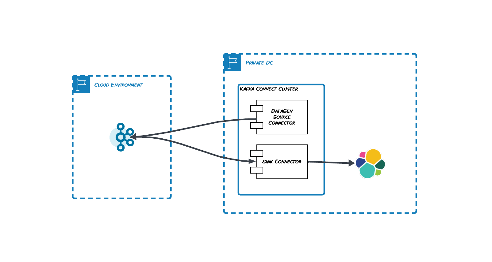

# Kafka Connect - Bridge to the Cloud

## Prerequisites

- Docker Compose 
- One Basic Cluster on Confluent Cloud
- OPTIONAL, if you need a REST Client only - VS Code with [VS Code REST Client](https://marketplace.visualstudio.com/items?itemName=humao.rest-client)

## Configure Credentials

Create a `.env` like the one below and put inside of it your Confluent Cloud credentials and the Kafka bootstrap server.

```
# CFLT 
CFLT_TAG=7.6.0
CCLOUD_API_KEY=
CCLOUD_API_SECRET=
CCLOUD_BOOTSTRAP_SERVER=

# ELASTIC
ELASTIC_PASSWORD=adminadmin
KIBANA_PASSWORD=adminadmin
STACK_VERSION=8.13.4
CLUSTER_NAME=docker-cluster
LICENSE=trial
ES_PORT=9200
# Port to expose Kibana to the host
KIBANA_PORT=5601
# Increase or decrease based on the available host memory (in bytes)
MEM_LIMIT=6442450944
```

## Architecture



## Run

```
docker-compose -f docker-compose.yaml -f docker-compose.elastic.yaml up -d
```

A Kafka Connect Cluster on docker compose will be launched.  
Once the cluster is up and running you can create your first connectors.

## Create Connectors

```
curl --request PUT \
  --url http://localhost:8083/connectors/datagen/config \
  --header 'content-type: application/json' \
  --data '{"connector.class": "io.confluent.kafka.connect.datagen.DatagenConnector","kafka.topic": "transactions","quickstart": "transactions","key.converter": "org.apache.kafka.connect.storage.StringConverter","value.converter": "org.apache.kafka.connect.json.JsonConverter","value.converter.schemas.enable": "false","max.interval": 60000,"tasks.max": "1"}'

curl --request PUT \
  --url http://localhost:8083/connectors/my-es-sink/config \
  --header 'content-type: application/json' \
  --header 'user-agent: vscode-restclient' \
  --data '{"connector.class": "io.confluent.connect.elasticsearch.ElasticsearchSinkConnector","errors.log.include.messages": "true","config.action.reload": "restart","errors.log.enable": "true","tasks.max": "1","errors.deadletterqueue.topic.replication.factor": "1","value.converter": "org.apache.kafka.connect.json.JsonConverter","value.converter.schemas.enable": "false","errors.retry.timeout": "10","topics": "transactions","errors.retry.delay.max.ms": "5000","behavior.on.malformed.documents": "warn","flush.timeout.ms": "10000","errors.tolerance": "all","connection.url": "http://elasticsearch:9200","connection.username": "elastic","connection.password": "adminadmin","schema.ignore": "true","transforms": "ElasticSearchAlias","transforms.ElasticSearchAlias.type": "org.apache.kafka.connect.transforms.RegexRouter","transforms.ElasticSearchAlias.regex": ".*","transforms.ElasticSearchAlias.replacement": "index_$0","flush.synchronously": "true"}'
```

## Check your connectors output

Visit [http://localhost:5601](http://localhost:5601) and login with `elastic` and `adminadmin`, check for indexes and look inside of them. 


## Teardown

```
docker-compose -f docker-compose.yaml -f docker-compose.elastic.yaml down -v
```

## Customization

You can add as many plugins as you want. Just put them in the `volumes/connect-plygin-jars` folder and run the docker compose. 